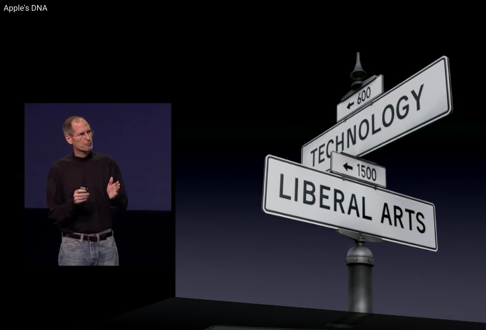

## What you need to know about Computers and Programming Job?

##### How to get started on programming?

---

## Introduction

This is Rajasekar Elango, Software Engineer at Salesforce.com

+++

@title[About Audience]

What are you curious to know about computer science?

Note: I encourage you to ask question whenever you have. Please don't hesitage.

---
## Are computers smart?
@title[Computers are stupid]

Computers are really **stupid**. But it is very *fast*. 

Humans are **smart**, but *slow*. 

+++
@title[Binary Introduction]

Infact, the hardware inside the computer doesn't know anything other than 0’s and 1’s - refered as ***binary***

+++
@title[Everything is stored as binary]

So all the videos, music and textual information you see in computers are stored as just 0’s and 1’s in hardware. 

---

## Why the digital world is based on binary?
@title[Why digital world is binary?]

All the hardware is made from wonderful semiconductor material ***silicon***. 

 It can easily change state between stop conducting ( **0** ) and start conducting ( **1** ) electricity through them. 

Silicon is used to make a tiny device called ***transistor*** which stores one bit of 0 or 1. 

Note: Discuss about conductors and insulators.

---

## What's inside Computers?

> Computers are made of billions of tiny ***transistors*** which can be programmed to flip states between 0 and 1 using electrical signals.

+++

Just like billions of neurons fire in our Human brain based on visual, auditory or sensory signal.

---

## Why computers is a genius invention? 

- It will be super expensive, if we had to build a new computer for every different thing we want to do. 

- Instead, we invented a general purpose computer containing a assembly of transistors that can do many different things, depending on which transistors are swiched on and off.  

---

## What is a Computer?

> `Computer is a electronic machine that can be programmed to do zillions of different tasks.`

 It could do anything from adding two numbers to flying an airplane.

+++
@title[Essential components of the computers]

### A Computer has

#### Processor

* Does the computational work.

* The speed of the proccessor determines how fast computer can do the tasks.

+++

#### Memory

* Stores all the information.

* Memory capacity basically indicates you how many 0's and 1's it can store

+++

#### How many of you know what does GB or MB mean in phone or computers?
@title[What does GB Mean?]

 Mega Bytes or Gigabytes is unit for measuring memory just like pounds for weight, ounces for liquid etc. 

<table class="fragment"> 
	<tr>
		<td>1 Bit </td>
		<td>= Binary Digit 0 or 1 </td>
	</tr>
	<tr>
		<td>8 Bytes </td>
		<td>= 1 Byte </td>
	</tr>
	<tr>
		<td>1024 Bytes </td>
		<td>= 1 Kilobyte (KB) </td>
	</tr>
	<tr>
		<td>1024 Kilobytes</td>
		<td>= 1 Megabyte (MB) </td>
	</tr>
	<tr>
		<td>1024 Megabytes</td>
		<td>= 1 Gigabyte (GB) </td>
	</tr>
</table>

+++
#### Input interface

Like keyboard, touch screen, scanner etc

+++

#### Output interface

Like Monitor, Speaker, Printer, etc

---

## How do you tell Computers to do something?
@title[What are Algorithms?]
+++

We need to provide a sequence of instructions telling a computer to what to do which is called as ***Algorithms***.

+++

### How transistors execute Algorithms?

Transistors are combined to create ***logic gates*** that can perform logical operations like ***AND***, ***OR***, ***NOT***

Every algorithm, no matter how complex, can be reduced to just these three operations: AND, OR, and NOT.

+++

### Algorithm example

if a fever can be caused by influenza or malaria, and you should take Tylenol for a fever and a headache

+++

### Algorithms can solve complex problems

Algorithms can be combined together to solve complex problems.

Just like simple mathematical operations are combined to produce complex mathematical formulas.

+++
### Algorithms are everywhere

Algorithms fly the airplanes, forecast weather. They run factories, tell us driving directions and so on.

*Scientists make theories, and engineers make devices. Computer scientists make algorithms that connects both theories and devices.*

---
## What is Programming?

@title[What is Programming?]

> `Programming is the act of taking complicated human ideas and breaking them down into simple algorithms that computers can understand and follow.`

A Programmer creates algorithms and codes them up in human friendly language like `Java` or `Python`

---
## What is Software?
@title[What is Software?]

Software is collection of programs that are written in language humans can understand and then they are converted into binary that computers can understand to execute them.

Softwares run computers, smart phones, ATM machines, Billing machines.

---

## Why Software is Eating the World?

* Six decades after the computer revolution

* Four decades since the invention of the microprocessor

* Two decades into the rise of the modern Internet
  ​
* All of the technology required to transform every industry through software possible today.

+++

### Every Industry is revolutioned by Software

* Finance — Stock market, Paypal
* Retail — Amazon, online shopping
* Movies — Animation, Netfix
* Telecom — Skype
* Education — KhanAcademy, Udemy

Note: The best new movie production company in many decades, Pixar, was a software company. Disney — had to buy Pixar, a software company, to remain relevant in animated movies.

---

## Why being a Software developer is Great?

+++

### Drives creativity and innovation

* It's very creative profession as much like a musician or a painter.

* Programming is fundamentally about creating  solutions to problems. 

+++

### Make people's life better

You will solve problems to make people's life better.

+++

### Impact millions of people quickly

Telephone took 75 years, Internet took 4 years however Angry Birds took only 35 days!!

+++

### Colloborative 

Software engineering is a team sport and you work together to build amazing things.

+++

### Future proof

As per US-BLS projections, computing will be the safest STEM career options for the foreseeable future.

+++

### Pays well

* Because of high demand, Software engineers are paid well.

* Software engineers can create lot of value with no cost of raw materials.

* All you need is your time and a computer.

+++

### Work from anywhere.

With the internet, you can literally work from any where in the world.

---
## What are the triats for becoming Software engineer?

+++
### Love making things for other people to use

* At end of the day, you have created something that didn't exist that morning.

+++

### Enjoy solving puzzles

* You are passionate about making progress from a unknown state of a problem to arriving at a working solution.

+++

### Like Experimenting and Research

* You like conduction experiments, you will try something, if it doesn't work scratch that off and try different approach.
* You also like doing research, you have to search the web, read the documentation, refer the books to come up with a solution.

+++

### You want to make things easier

Bill Gates said he would always 'hire a lazy person to do a difficult job' at Microsoft 'because a lazy person will find an easy way to do it'

+++

### You have interest in both Arts and Engineering.

* Software engineering utilizes right mix of both Artistic and Engineering skills.
* Writing a program is an art like writing a poem at the same time it needs applying logical skills to solve the problem.

+++
@title[Intersection of Arts and Technology]
According to Steve Jobs -- The greatest innovations come from the intersection of technology and arts.

+++

### You have Joy in Continous learning

* You need to continously learn new things and keep up ever changing technology.

---

## What's fascinating about future of Computers?

What if we can teach Computers to learn by itself.

We are heading towards making machines to learn and creating artificial intelligent systems.

+++

### What is Machine learning?

Machine learning makes computers to learn skills that humans can't explain.
Machine learning works by analysing large data set of examples and figuring out Algorithm.
We can think of machine learning as inverse of programming just like Square root is inverse of Square.
With machine learning, computers write their own programs, so we don’t have to.

+++

### Machine learning makes computer learn human skills

* [AutoDraw](https://www.autodraw.com/) is a that pairs the magic of machine learning with drawings from talented artists to help everyone create anything visual, fast. 
* Computers can recognize our face, our voice, handwriting , etc.

+++

### Robots are becoming part of your lives

* iRobot vaccum can find it's way through your home to clean everywhere.
* Siri , Alexa, Google Assistant are able to answer our questions just like humans.

+++

### Computers beat human world champions.

* Deep Blue (Chess computer) beat World Chess Champion Garry Kasparov in 1997.
* In 2015, AlphaGo beat Go world Ke Jie. 
* Go is very complex game compared to Chess, it won't be possible without machine learning.

+++

### How will future look like?

* Self driving cars will become common on the road.
* Every home will have some kind of a Bot.
* All devices in your house will be a smart device like smart phones.
* You will be helped by Chat Bots and Virtual assitants on the internet.

---

## How to Get Started on learning to Program?

* https://code.org/ — The most well known and popular project that teaches kids to code.
* http://lightbot.com/ — This mobile game starts really easy and adds more and more complex concepts over time eventually getting quite challenging. 
* https://www.codingame.com/start — is aimed at more experienced and older kids, teaching more complex techniques
* https://www.allcancode.com/home — Uses visual programming language to learn how to code and build amazing apps
* http://scratch.mit.edu/ You can program your own interactive stories, games, and animations.
* [Lego mind storms](http://www.lego.com/en-us/mindstorms/?domainredir=mindstorms.lego.com) -- build programmable robots based on Lego building blocks.
* https://www.khanacademy.org/>  — Build apps using Javascript guided by video tutorials.

+++

### Books

* [Python-Kids-Playful-Introduction-Programming](http://www.amazon.com/Python-Kids-Playful-Introduction-Programming/dp/1593274076)
* [Hello World!: Computer Programming for Kids and Other Beginners](http://amzn.com/1617290920)
 

## Credits

[Five Reasons why software engineering is a great career choice.](https://henrikwarne.com/2014/12/08/5-reasons-why-software-developer-is-a-great-career-choice/amp/)

[Why Software is Eating World](https://a16z.com/2016/08/20/why-software-is-eating-the-world/)

[The market for computing careers](https://cs.calvin.edu/documents/computing_careers)

[To reach 50 Million users Angry bird took only 35 days](https://www.techworm.net/2015/03/to-reach-50-million-users-telephone-took-75-years-internet-took-4-years-angry-birds-took-only-35-days.html/amp)

[The Master Algorithm: How the Quest for the Ultimate Learning Machine will Remake our world](http://amzn.to/2DtRt47)