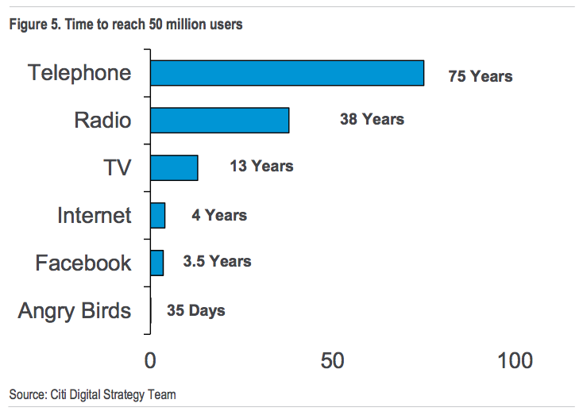
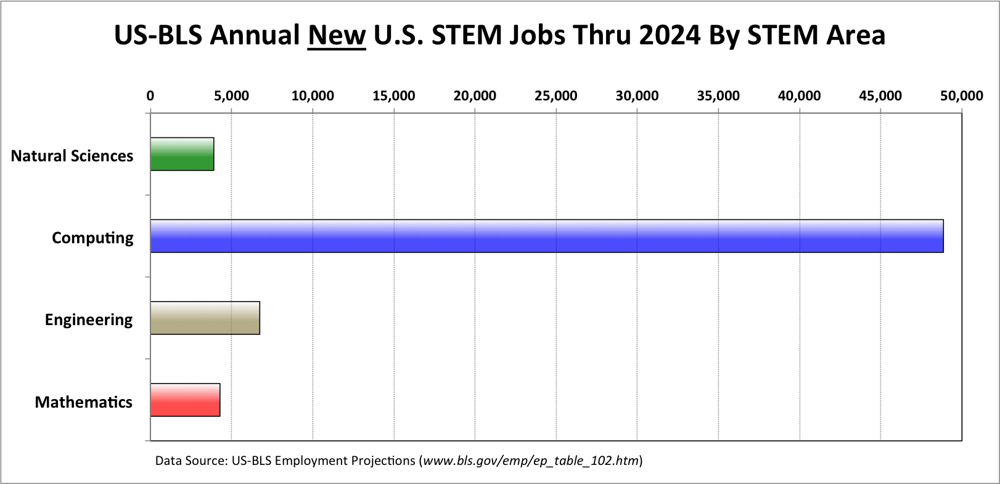

## What you need to know about Computers and Programming Job?

##### How to get started on programming?

---

## Introduction

This is Rajasekar Elango, Software Engineer at Salesforce.com

+++

@title[About Audience]

What are you curious to know about computer science?

Note: I encourage you to ask question whenever you have. Please don't hesitage.

---
## Are computers smart?

@title[Computers are stupid]

- Computers are really **stupid**. But it is very *fast*. | 
- Humans are **smart**, but *slow*. |

+++

@title[Binary]

Infact, the processors inside the computer doesn't know anything other than 0’s and 1’s - refered as **binary**

+++

@title[Binary Storage]

So all the videos, music and textual information you see in computers are stored as just 0’s and 1’s in hardware. 

---

## Why the digital world is based on binary.?

+++

@title[Why 0s and 1s?]

All the hardware is made from wonderful semiconductor material ***silicon***. It can easily change state between stop conducting ( **0** ) and start conducting ( **1** ) electricity through them.

One bit of information ( 0 or 1) is stored in tiny device called ***transistor***  and they are made from silicon.

Note: Discuss about conductors and insulators.

---

## What's inside Computers?

+++

> Computers are made of billions of tiny ***transistors*** which can be programmed to flip states between 0 and 1 using electrical signals.

+++

Just like billions of neurons fire in our Human brain based on visual, auditory or sensory input.

+++

### Why computers is a genius invention? 

We invented a general purpose computer containing a vast assembly of transistors that can do many different things, depending on which transistors are activated.

It could do something from adding two numbers to flying an airplane.

Note: It would be very expensive, if we had to build a new computer for every different thing we want to do. 

+++

### What are computers?

> Computer is a electronic machine that can be programmed to do zillions of different tasks.

It could do something from adding two numbers to flying an airplane.

+++
@title[Essential components of the computers]

### What are components of a computer?

#### Processor

Does the computational work.

The speed of the proccessor measured in Giga Hertz GHz tells us how many instructions processor can do in a second.

+++

#### Memory

Stores all the information.

+++

##### How many of you know what is GB or MB mean in iphone or computers?
@title[What does GB Mean?]

- Bytes or Gigabytes is unit for measuring memory just like pounds for weight, ounces for liquid etc. | 
- Memory capacity in bytes basically tells you how many 0's and 1's it can store. | 

+++

* `Input interface` — keyboard, touch screen etc
* `Output interface` —  Monitor, Speaker

---

## How do you tell Computers to do something?

+++

We need to provide a sequence of instructions telling a computer to what to do which is called as ***Algorithms***.

+++

### How transistors execute Algorithms?

Transistors are combined to create ***logic gates*** that can perform `AND` `OR` and `NOT`.

Every algorithm, no matter how complex, can be reduced to just these three operations: AND, OR, and NOT.

+++

### Algorithm example

if a fever can be caused by influenza or malaria, and you should take Tylenol for a fever and a headache

+++

### Algorithms are everywhere

Algorithms schedule flights and then fly the airplanes. Algorithms run factories, trade and route goods, cash the proceeds, and keep records.

Scientists make theories, and engineers make devices. Computer scientists make algorithms that connects both theories and devices.

---

you have to write it down in a language computers can understand, like Java or Python

---

## What is programming?

@title[What is Programming?]

> Programming is the act of taking complicated human ideas and breaking them down into simple enough instructions that a computer can understand and follow.

Then the computer can perform your idea super-fast for you.

+++

@title[What is software?]

~~Software programs are written in language humans can understand and then they are converted into binary that computers can understand to execute them.~~

---

## Why Software is Eating the World?

* Six decades into the computer revolution

* Four decades since the invention of the microprocessor

* Two decades into the rise of the modern Internet

  ​

All of the technology required to transform every industry through software possible today.

+++

## Every Industry is revolutioned by Software

* Finance — Stock market, Paypal
* Retail — Amazon, online shopping
* Movies — Animation, Netfix
* Telecom — Skype
* Education — KhanAcademy, Udemy
* Healthcare 

Note: The best new movie production company in many decades, Pixar, was a software company. Disney — had to buy Pixar, a software company, to remain relevant in animated movies.

---

## Why being a Software developer is Great?

+++

#### Drives creativity and innovation

* It's very creative profession as much like a musician or a painter.

* You create new things that doesn't exist before.

+++

#### Make people's life better

You will solve problems to make people's life better.

+++

#### Impact millions of people quickly

Telephone took 75 years, Internet took 4 years however Angry Birds took only 35 days!!

+++

#### Colloborative 

Software engineering is a team sport and you work together to build amazing things.

+++

#### Future proof

As per US-BLS projections, computing will be the safest STEM career options for the foreseeable future.

+++

#### Pays well

* Because of high demand, Software developers are paid well.

* Software developers can create lot of value with no cost of raw materials.

* All you need is your time and a computer.

+++

#### Work from anywhere.

With the internet, you can literally work from any where in the world.

---
## What are the triats for becoming software developer?

@title[Trias of programmers]

* Being Lazy
* Experimenting and Research
* Right mix of creativity (Arts) and logic (Engineering)
* Continous learning

---

## Future of Computers

* Self driving cars
* Deep blue beats Chess Champion Kasparov
* AlphaGo beating Ke Jie, Go World Champion
* ​

---

## Credits

[Five Reasons why software engineering is a great career choice.](https://henrikwarne.com/2014/12/08/5-reasons-why-software-developer-is-a-great-career-choice/amp/)

[Why Software is Eating World](https://a16z.com/2016/08/20/why-software-is-eating-the-world/)

[The market for computing careers](https://cs.calvin.edu/documents/computing_careers)

[To reach 50 Million users Angry bird took only 35 days](https://www.techworm.net/2015/03/to-reach-50-million-users-telephone-took-75-years-internet-took-4-years-angry-birds-took-only-35-days.html/amp)

[The Master Algorithm: How the Quest for the Ultimate Learning Machine will Remake our world](http://amzn.to/2DtRt47)