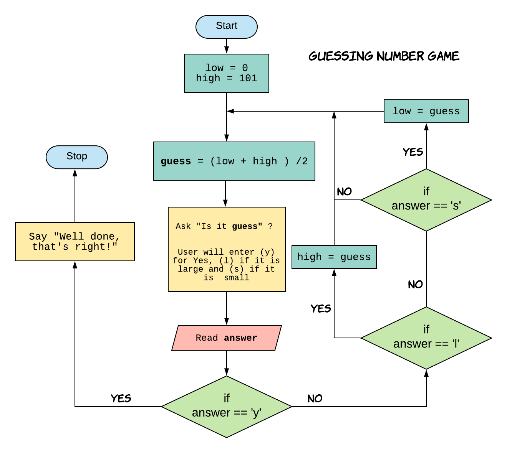

## Introduction to Programming Using Python

---

## Guessing Number Game

1. Think of a number between 1 and 100.
2. Computer will make a guess and you will answer whether the guess is correct or small or larger than the computer's guess.
3. Computer will make next guess based on the information and you will respond again with correct or small or large.
4. Repeat this until computer makes right guess.

Can you come up with an algorithm for computer to solve this?

+++

### Guessing Number Game Algorithm.

