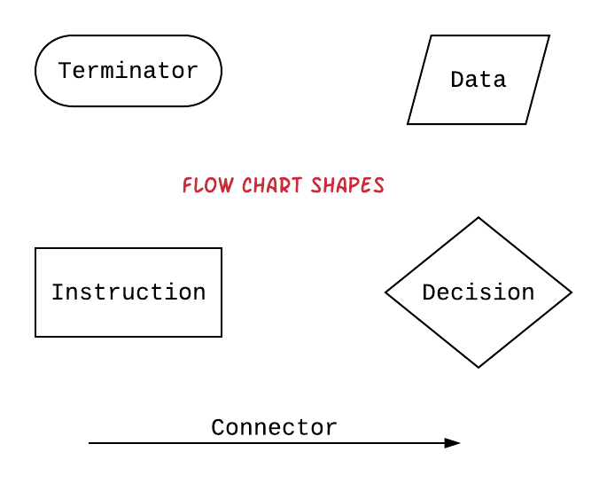
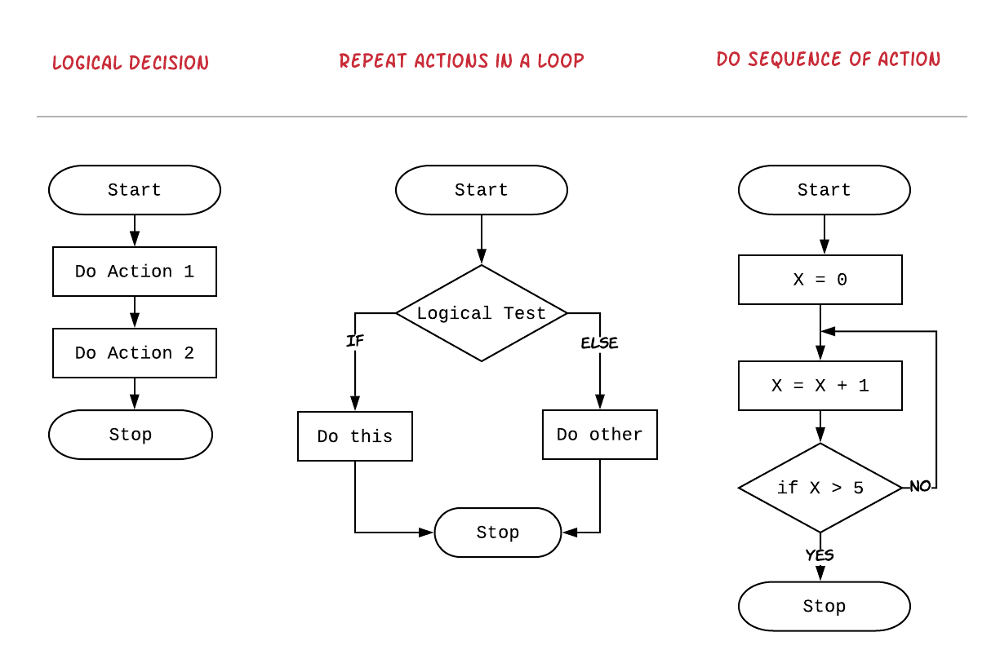
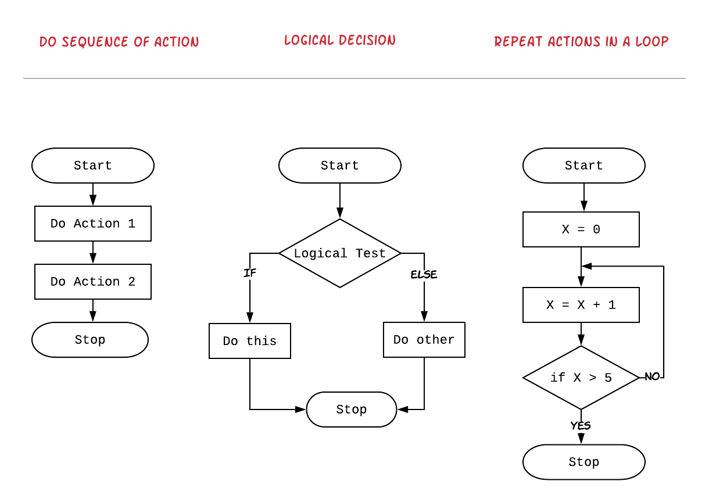
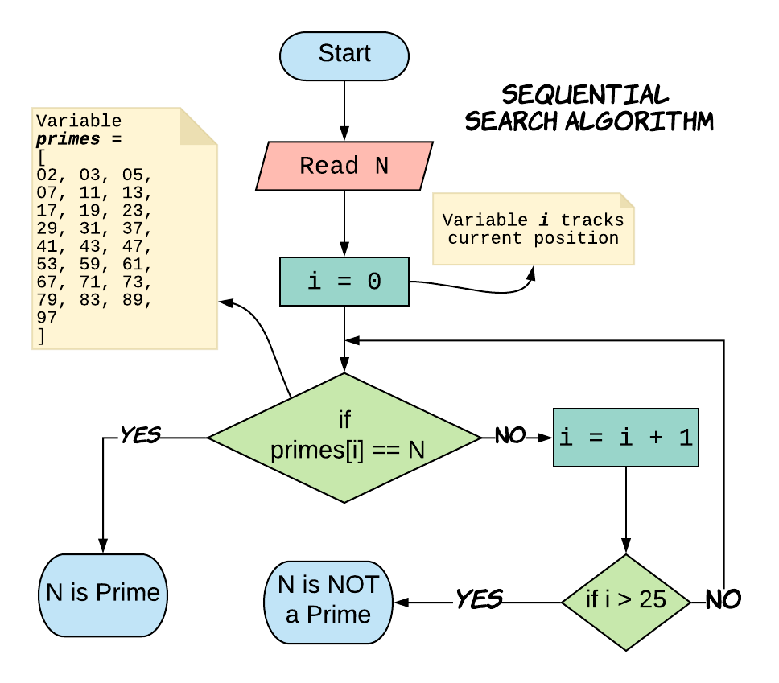
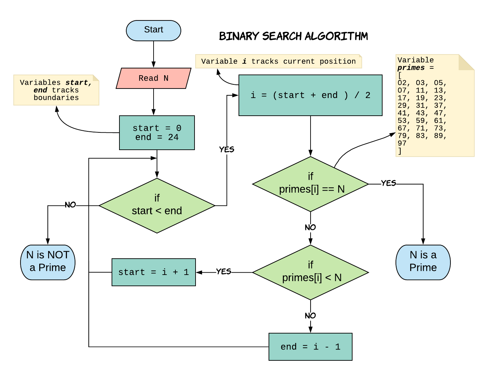

## Introduction to Search Algorithms

---

## What is Search Algorithm 

> A ***search algorithm*** is the step-by-step procedure used to locate specific data among a collection of data.

---
## Search Examples in Computers


---

## What is Flowchart?

*A **Flowchart** is a type of diagram used to represent algorithms.*



+++

### Quiz: Match flowchart to an Algorithm



+++

### Solution: Match flowchart to an Algorithm



---

## Operators 

<table> 
	<tr>
		<td>Arithmetic </td>
		<td class="fragment"> <code> + , - , / , * </code></td>
	</tr>
	<tr>
		<td>Reminder </td>
		<td class="fragment"> % </td>
	</tr>
	<tr>
		<td>Assignment </td>
		<td class="fragment"> = </td>
	</tr>
	<tr>
		<td>Comparison</td>
		<td class="fragment"> <code>> , >= , < , <= , == , !=</code></td>
	</tr>
</table>

+++

## What are variables?

A ***variable*** associates a name to a value or result of an operation.


```
Examples:

A = 10

x = x + 1
```

---

## How to represent collection of items?

The ***Array*** is the simplest way to store a bunch of items in computer memory.

```java

Examples:

Array primes = [2, 3, 5, 7, 11,
				13, 17, 19, 23, 29,
				31, 37, 41, 43, 47,
				53, 59, 61, 67, 71, 
				73, 79, 83, 89, 97]
```

+++

### How look up values in array?

@title[Look up arrays]

Values in array can be looked up using index operator `variableName[index]`

```java
primes[0] = 2
primes[1] = 3
....
primes[24] = 97

```

In computer science, index always starts with ***0***

---
## Problem : Check if a number is prime

Let's say we have all prime numbers less than 100 stored in a array `primes`

Given any number N between 1 and 100, tell if the number is a prime by searching the array `primes`.

---

## Sequencial Search Algorithm



---
## Binary Search Algorithm



---

## Limitations of binary search

- The collection has to be pre-sorted. |

---

## Other Techniques for search

- Indexing like in books or dictionaries |
- Categorizing and sorting like in library book shelves | 

---

## Guessing Number Game

1. Think of a number between 1 and 100.
2. Computer will make a guess and you will answer whether the guess is correct or low and higher than the computer's guess.
3. Computer will make next guess based on the information and you will respond again with correct or low or high.
4. Repeat this until computer makes right guess.

Can you come up with an algorithm for computer to solve this?

+++

### Guessing Number Game Algorithm.


