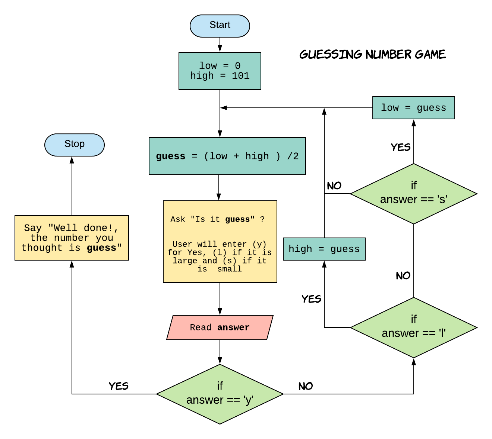

## Introduction to Programming Using Python

---

## Guessing Number Game

1. Think of a number between 1 and 100.
2. Computer will make a guess and you will answer whether the guess is correct or small or larger than the computer's guess.
3. Computer will make next guess based on the information and you will respond again with correct or small or large.
4. Repeat this until computer makes right guess.

Can you come up with an algorithm for computer to solve this?

+++

### Guessing Number Game Algorithm.

---

## Introduction to Python

- Python is a good general-purpose language that can be used in a variety of applications.
- Python is a very humanreadable, programming language.
- Python is a very good choice for beginners.

---

## Basic Data Types

<table>
	<tr>
		<td>Data Type </td>
		<td>Examples </td>
	</tr>
	<tr>
		<td>Integer (int)</td>
		<td>0, 100</td>
	</tr>
	<tr>
		<td>String (str)</td>
		<td>"Hello" , "World"</td>
	</tr>
	<tr>
		<td>Boolean (bool)</td>
		<td>True, False, logical condition</td>
	</tr>
</table>

---

## Python programm for Guess number game.

https://repl.it/@erajasekar/GuessNumberGame

<iframe width="800" height="500" frameborder="0" src="https://pythontutor.com/iframe-embed.html#code=answer%3D%22%22%0Alow%3D0%0Ahigh%3D101%0A%23count%3D0%0A%0Aprint%28%22Think%20a%20Number%20from%201%20to%20100.%20I%20will%20try%20to%20guess%20it.%22%29%0A%23input%28%22Press%20Enter%20to%20continue...%5Cn%22%29%0A%0Awhile%20answer!%3D%22y%22%3A%0A%20%20%20%20guess%3D%28low%20%2B%20high%29//2%0A%20%20%20%20%23count%3Dcount%20%2B%201%0A%20%20%20%20print%20%28%22Is%20it%20%22,%20guess,%20%22%3F%5Cn%22%29%0A%20%20%20%20answer%3Dinput%28%22Type%3A%20%28y%29%20for%20Yes,%20or%20%28l%29%20if%20it%20is%20to%20Large,%20or%20%28s%29%20if%20it%20is%20to%20Small%3A%22%29%0A%20%20%20%20if%20answer%3D%3D%22l%22%3A%0A%20%20%20%20%20%20high%3Dguess%0A%20%20%20%20elif%20answer%3D%3D%22s%22%3A%0A%20%20%20%20%20%20low%3Dguess%0A%20%20%20%20elif%20answer%3D%3D%22y%22%3A%0A%20%20%20%20%20%20break%0A%0Aprint%28%22%5CnGreat!%20the%20number%20that%20you%20thought%20is%3A%20%22,%20guess%29%0A%23print%28%22%5Cn%20Guessed%20in%20%22%20%2B%20str%28count%29%20%2B%20%22%20tries%20%22%29%0A&codeDivHeight=400&codeDivWidth=350&cumulative=false&curInstr=0&heapPrimitives=false&origin=opt-frontend.js&py=3&rawInputLstJSON=%5B%5D&textReferences=false"> </iframe>

---

## Python program for sequential search

https://repl.it/@erajasekar/PrimesSequentialSearch

---

## Python Program for Binary Search

https://repl.it/@erajasekar/PrimesBinarySearch

